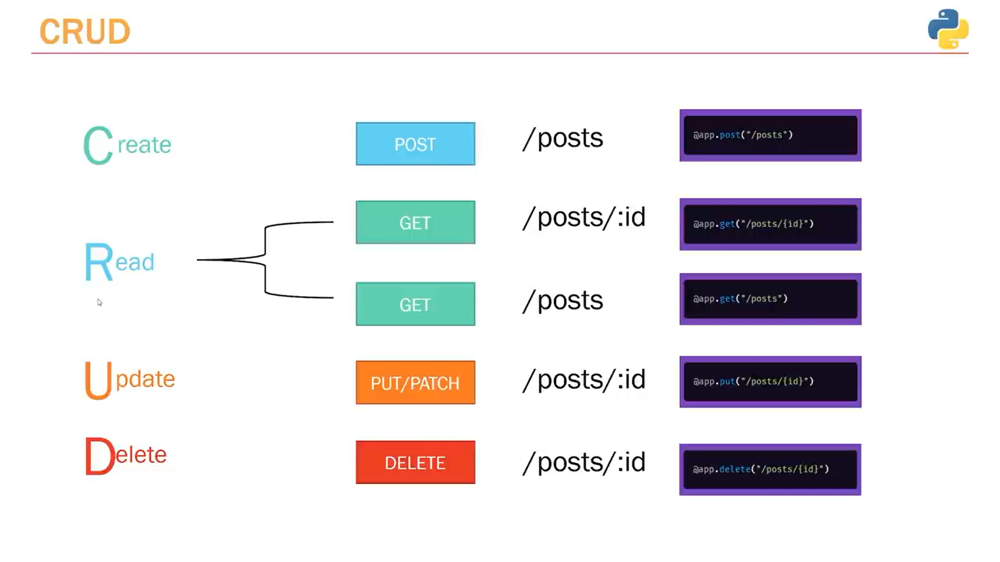

# Fast Api Tutorial

## Social Media Application API

### Following Sanjeev Tygarajan Tutorial

## Day 1 of 20

<!-- Path Defination or Route Defination-->

```
@app.get("/api/")
async def root():
return {"message": "Hello From FastAPI"}
```

```
line 1 represents a decorator of the path or say endpoint, it is important to make the api work
line 2 represents the function which must be invoked when the endpoint is called
line 3 return the data object after the operation is complete
```

```
On further breaking down
-> "get" is a http method which returns the data object which we requested
-> "/api/" represents the path of the endpoint, this is really important too. When want the user data we use "/api/users" and when we want the post data we use "/api/post" these two paths are completely different and has different jobs to do. That is why path is provided in the function representing that this method must be invoked only when this path is called
-> "post", "put", "delete" are other http methods we have
-> "async" represents that the method is asynchronous, this is used when the function is interacting with the database and we might have to do something without wait for the response
-> "root" is the method name it can be anything
```


### Command to start the server : uvicorn main:app --reload

## Day 2 of 20

## Sending a POST request to the server

### Using 'Body' to get the body of the request

```
from fastapi.params import Body
@app.post("/api/posts/")
async def create_post(req: dict = Body(...)):
    print(req)
    return {"message": "Create a new post"}
```

```
-> In 'create_post' we are sending a post request to the API we are creating
-> The parameters of the method represent the data to be sent to the server from the frontend
-> 'Body' which is imported from fastapi.params represents the data inside the body of the POST request and converts it into a dictionary
```

```
from Models.PostModel import Post
@app.post("/api/posts/")
async def create_post(post: Post):
    print(post)
    return {"message": "Create a new post"}
```

```
-> We now replaced the 'Body' with 'Post' which represents the schema of the post
```

### Using Post Schema

```
-> We use Pydantic library to create the model of the posts
from pydantic import BaseModel
class Post(BaseModel):
    title:str
    content:str
    published: bool: False
    votes: Optional[int] = None

```

```
-> 'BaseModel' represents a class in pydantic library
-> 'Post' extends the class and defines the fields of the post
-> 'title' and 'content' represent mandatory fields
-> 'published' and 'votes' represent optional fields
-> 'votes' represents optional field which only accepts integer values and with default value of 'None'
-> 'published' represents the default boolean value with default value of 'False'

```

### CRUD Methods


